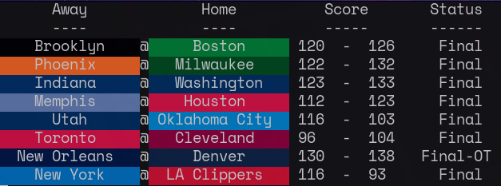

# nba-scores-cli
A command line program to view current NBA scores from the terminal.



> Game scores are scraped from [NBC
 Sports](https://scores.nbcsports.com/nba/scoreboard.asp?meta=true)

<!-- ## Installation -->

## Usage
To get the scores for the current day:
```bash
./target/release/nba-scores-cli
```

To get the scores from yesterday:
```bash
./target/release/nba-scores-cli -d y
```

To see the games scheduled for tomorrow:
```bash
./target/release/nba-scores-cli -d T
```

